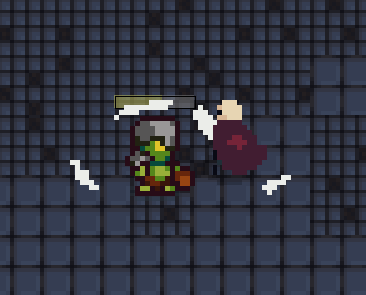

# 2D Dungeon Game

## Description

Dungeon Descent is a thrilling top-down adventure game where you explore mysterious dungeons, battle fearsome enemies. The game engine is built using Java and incorporates various game development techniques and design patterns.

## Features

- Engaging top-down gameplay
- Multiple levels to explore
- Enemies to battle
- Smooth character animations
- Intuitive controls
- Pixel art graphics

## Technical Features

- Object-Oriented Programming (OOP) principles applied for modular and maintainable code
- Utilization of design patterns such as State, Observer, and Strategy for flexible and extensible architecture
- Implementation of a robust collision detection system for precise hit detection and map boundaries
- Development of an intelligent enemy AI system using the State Pattern for dynamic behavior (patrol, chase, attack)
- Integration of a save/load system with SQLite database for persistent game states
- Creation of a camera system with smooth transitions and player tracking
- Implementation of an entity management system for handling multiple game objects and their interactions
- Incorporation of a sprite animation system supporting multiple animation states (idle, walk, attack)

## Screenshots

## Note

Please note that this repository contains only the source code of the game and cannot be run directly. The `res` folder, which contains essential game resources such as images, sounds, and level data, is not included due to licensing restrictions. The purpose of this repository is to showcase the game's source code and demonstrate the implementation of various game development techniques.

If you have any questions or would like to learn more about the game, feel free to reach out to me.

Happy gaming!
